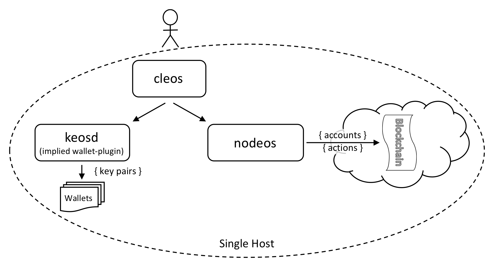

## Goal

This section describes how to set up a single-node blockchain configuration running on a single host.  This is referred to as a _**single host, single-node testnet**_.  We will set up one node on your local computer and have it produce blocks.  The following diagram depicts the desired single host testnet.



`clio` is used to manage the wallets, manage the accounts, and invoke actions on the blockchain.  `keosd` performs wallet management, including digital signing.  If not started explicitly, `keosd` is started by `clio` by default.

## Before you begin

* [Install the Antelope software](../../../00_install/index.md) before starting this section.
* It is assumed that `nodeop`, `clio`, and `keosd` are accessible through the path.  

[//]: # (THIS IS A COMMENT, NEXT LINK HAS BROKEN LINK)  
[//]: # (If you built Antelope using shell scripts, make sure to run the Install Script ../../../00_install/01_build-from-source/01_shell-scripts/03_install-antelope-binaries.md .)  

* Know how to pass [Nodeos options](../../02_usage/00_nodeop-options.md) to enable or disable functionality.

## Steps

Open one "terminal" window and perform the following steps:

1. [Start the Producer Node](#1-start-the-producer-node)
2. [Get Node Info](#2-get-node-info)

### 1. Start the Producer Node

Start your own single-node blockchain with this single command:

```sh
nodeop -e -p sysio --plugin sysio::chain_api_plugin --plugin sysio::history_api_plugin
```

[[info | Nodeos Minimal Options]]
| A minimal `nodeop` instance setup for block production requires both `chain_api_plugin` and `history_api_plugin` with the `-e` option (enable stale production) and `-p sysio` option (producer name `sysio`). Alternatively, you can also setup and specify your own account as the producer name.

After running `nodeop`, you should get log messages similar as below. It means the blocks are successfully produced.

```console
1575001ms thread-0   chain_controller.cpp:235      _push_block          ] initm #1 @2017-09-04T04:26:15  | 0 trx, 0 pending, exectime_ms=0
1575001ms thread-0   producer_plugin.cpp:207       block_production_loo ] initm generated block #1 @ 2017-09-04T04:26:15 with 0 trxs  0 pending
1578001ms thread-0   chain_controller.cpp:235      _push_block          ] initc #2 @2017-09-04T04:26:18  | 0 trx, 0 pending, exectime_ms=0
1578001ms thread-0   producer_plugin.cpp:207       block_production_loo ] initc generated block #2 @ 2017-09-04T04:26:18 with 0 trxs  0 pending
...
sysio generated block 046b9984... #101527 @ 2018-04-01T14:24:58.000 with 0 trxs
sysio generated block 5e527ee2... #101528 @ 2018-04-01T14:24:58.500 with 0 trxs
...
```
At this point, `nodeop` is running with a single producer, `sysio`.

### 2. Get Node Info

Get info about the producing node:

```sh
clio get info
```

This should produce output that looks similar to this:

```json
{
  "server_version": "0f9df63e",
  "chain_id": "cf057bbfb72640471fd910bcb67639c22df9f92470936cddc1ade0e2f2e7dc4f",
  "head_block_num": 134,
  "last_irreversible_block_num": 133,
  "last_irreversible_block_id": "00000085060e9872849ef87bef3b19ab07de9faaed71154510c7f0aeeaddae2c",
  "head_block_id": "000000861e3222dce1c7c2cfb938940d8aac22c816cc8b0b89f6bf65a8ad5bdc",
  "head_block_time": "2019-11-18T22:13:10.500",
  "head_block_producer": "sysio",
  "virtual_block_cpu_limit": 228396,
  "virtual_block_net_limit": 1197744,
  "block_cpu_limit": 199900,
  "block_net_limit": 1048576,
  "server_version_string": "v2.0.0-rc2",
  "fork_db_head_block_num": 134,
  "fork_db_head_block_id": "000000861e3222dce1c7c2cfb938940d8aac22c816cc8b0b89f6bf65a8ad5bdc",
  "server_full_version_string": "v2.0.0-rc2-0f9df63e1eca4dda4cb7df30683f4a1220599444"
}
```

## Advanced Steps

The more advanced user will likely have need to modify the configuration.  `nodeop` uses a custom configuration folder.  The location of this folder is determined by your system.

* Mac OS: `~/Library/Application\ Support/sysio/nodeop/config`
* Linux: `~/.local/share/sysio/nodeop/config`

The build seeds this folder with a default `genesis.json` file.  A configuration folder can be specified using the `--config-dir` command line argument to `nodeop`.  If you use this option, you will need to manually copy a `genesis.json` file to your config folder.

`nodeop` will need a properly configured `config.ini` file in order to do meaningful work.  On startup, `nodeop` looks in the config folder for `config.ini`.  If one is not found, a default `config.ini` file is created.  If you do not already have a `config.ini` file ready to use, run `nodeop` and then close it immediately with <kbd>Ctrl-C</kbd>.  A default configuration (`config.ini`) will have been created in the config folder.  Edit the `config.ini` file, adding/updating the following settings to the defaults already in place:

```console
# config.ini:

    # Enable production on a stale chain, since a single-node test chain is pretty much always stale
    enable-stale-production = true
    # Enable block production with the testnet producers
    producer-name = sysio
    # Load the block producer plugin, so you can produce blocks
    plugin = sysio::producer_plugin
    # As well as API and HTTP plugins
    plugin = sysio::chain_api_plugin
    plugin = sysio::http_plugin
    plugin = sysio::history_api_plugin
```

Now it should be possible to run `nodeop` and see it begin producing blocks.

```sh
nodeop
```

`nodeop` stores runtime data (e.g., shared memory and log content) in a custom data folder.  The location of this folder is determined by your system.

* Mac OS: `~/Library/Application\ Support/sysio/nodeop/data`
* Linux: `~/.local/share/sysio/nodeop/data`

A data folder can be specified using the `--data-dir` command line argument to `nodeop`.

[[info | What's next?]]
| We will explore how to setup and run a [single-host, multi-node testnet](01_local-multi-node-testnet.md).
