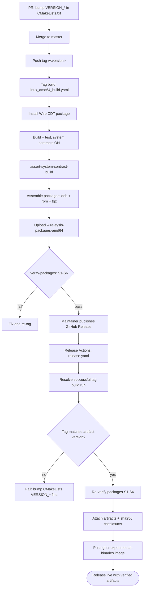
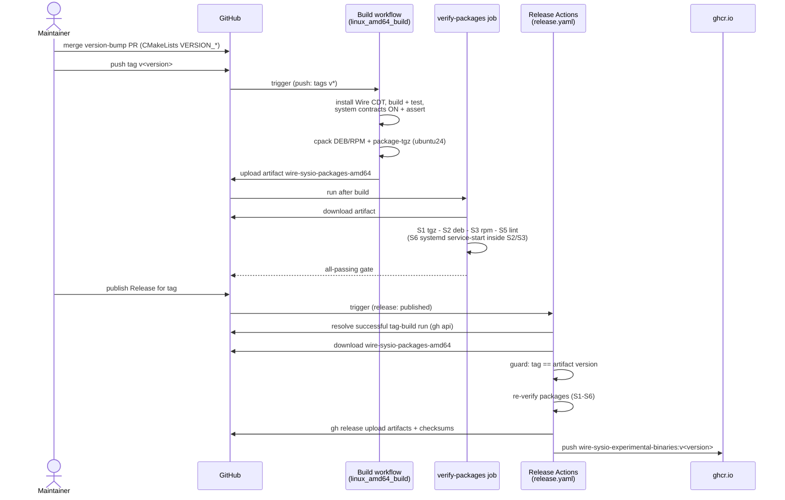

# Release Workflow

How a wire-sysio release goes from a version bump to a published GitHub
Release with verified artifacts attached. Artifact contents are documented in
[release-layout.md](release-layout.md); build commands in
[../BUILD.md](../BUILD.md).

## Overview

1. **Version bump** — a PR to `master` updates `VERSION_MAJOR/MINOR/PATCH/SUFFIX`
   in `CMakeLists.txt`. The version embedded in every artifact comes from here;
   the release workflow fails fast if it doesn't match the tag.
2. **Tag** — a maintainer pushes `v<version>`. The tag build
   (`linux_amd64_build.yaml`) installs the Wire CDT package, builds the system
   contracts from source (and asserts it), assembles the full package set
   (base + dev deb/rpm, portable tgz) on the `ubuntu24` platform, and the
   `verify-packages` job runs the packaging suite (S1-S6, including the
   systemd-in-container service-start gate) against the produced artifacts.
3. **Publish** — a maintainer publishes the GitHub Release for the tag. The
   `Release Actions` workflow (`release.yaml`) locates the successful tag
   build, downloads its `wire-sysio-packages-amd64` artifact, guards
   tag↔version consistency, re-verifies the packages, attaches them plus a
   sha256 checksums file to the release, and refreshes the
   `wire-sysio-experimental-binaries` ghcr image.

For pre-merge validation, `release.yaml` also exposes `workflow_dispatch`
with a `tag` input, which runs the same verify-and-attach path against an
existing tag + release without waiting for a `release: published` event
(those events always execute the workflow file from the default branch).

## Activity

## Sequence

