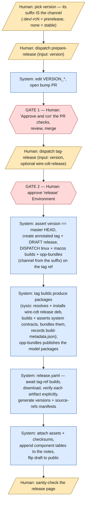

# Release Workflow

How a wire-sysio release goes from a version bump to a published GitHub Release
with verified artifacts attached. Artifact contents are documented in
[release-layout.md](release-layout.md); build commands in
[../BUILD.md](../BUILD.md).

## Strategy C — independent per-repo releases

wire-sysio and wire-cdt release **independently**. There is no cross-repo release
train and no shared pipeline: wire-cdt cuts its own release, and a wire-sysio
release **consumes a wire-cdt release asset resolved at build time**.

The properties that follow from that choice:

- **Resolve at build, record at release.** The tag build's `v` job resolves the
  wire-cdt release itself: an explicit `wire-cdt-release` dispatch input (on
  `tag-release.yaml`, forwarded to `linux_amd64_build.yaml`) wins; otherwise the
  latest **published** wire-cdt release in the same channel as the version being
  built is used. The build downloads that release's
  `wire-cdt_<version>_amd64.deb` asset, records the resolved tag in its
  `build-metadata.json` artifact, and `release.yaml` writes it durably into the
  release's `wire-sysio-versions-<version>.json` asset — the record of what the
  release was built against. (The former `.cicd/defaults.json` pin, written by
  `prepare-release.yaml`, is retired; the versions manifest replaced it.)
  For a one-off experiment against a different CDT, the same `wire-cdt-release`
  input works on a direct `linux_amd64_build.yaml` dispatch; its channel is then
  derived from the release's own prerelease flag instead of being asserted.
- **Release assets, not CI artifacts.** CI artifacts expire after 30 days, so an
  old tag could not be rebuilt from them. Release assets are durable.
  Wire-Network/wire-cdt is public, so the download needs no special token — the
  build's own `GITHUB_TOKEN` is passed to `gh` only to lift the unauthenticated
  rate limit. (The `.cicd/platforms` images all bake the GitHub CLI, so the
  download is a plain `gh release download`.)
- **The version's suffix IS the channel.** `-dev` / `-rcN` means prerelease; no
  suffix means stable. One input (`version`) decides everything downstream —
  the release's prerelease flag, which wire-cdt channel the build resolves in,
  and which channel the OPP model bundles publish under (`-dev` bundle versions
  on prerelease, bare versions on stable).
- **Two human gates.** Gate 1 is reviewing and merging the bump PR. Gate 2 is
  approving the `release` Environment before anything is tagged or created.
- **The system contracts ship as a release asset.** Only tag builds compile them
  (`BUILD_SYSTEM_CONTRACTS=ON` plus `assert-system-contract-build.sh`), and they
  are bundled as `wire-sysio-system-contracts-<version>.tar.gz`.

## Packaged layouts — this repo vs the consumed wire-cdt deb

The two repos package **differently on purpose**. Do not copy wire-cdt's private
home into wire-sysio.

| Artifact | Programs / payload | Notes |
|---|---|---|
| **wire-sysio deb / rpm** | `/usr/bin/nodeop`, `/usr/bin/clio`, `/usr/bin/kiod` — installed **directly**, own names, no private home and no symlink indirection | prefix `/usr`, `COMPONENT base`; plus `/usr/lib/systemd/system/`, `/usr/lib/tmpfiles.d/`, `/etc/logrotate.d/`. Asserted by `tools/packaging/tests/verify-{deb,rpm}.sh`. |
| **wire-sysio tarball** | self-contained tree | see [release-layout.md](release-layout.md) |
| **wire-cdt deb / rpm** (consumed) | self-contained toolchain home at `/usr/lib/cdt`, with only public `cdt-*` / `sysio-*` entry points symlinked into `/usr/bin` | distro-toolchain layout (cf. `/usr/lib/llvm-18`) |

wire-cdt needs the private home for one specific reason: it **bundles its own
LLVM**, so `clang`, `lld`, `llvm-ar` … would collide with the distro's `clang` /
`lld` / `llvm` packages if installed into `/usr/bin`. wire-sysio bundles no such
thing — `nodeop` / `clio` / `kiod` are unique names — so they install straight
into `/usr/bin` and must stay there.

`install-wire-cdt-package.sh` therefore exports `CDT_ROOT=/usr/lib/cdt` (the
toolchain home, not `/usr`): `build-sysio.sh` checks
`$CDT_ROOT/lib/cmake/cdt/cdt-config.cmake` and `cmake/contract-tools.cmake`
builds `$CDT_ROOT/lib/cmake/cdt/CDTWasmToolchain.cmake`, both of which only
resolve under the home.

## The workflows

| Workflow | Trigger | What it does |
|---|---|---|
| `prepare-release.yaml` | `workflow_dispatch(version)` | Validates the version, writes `VERSION_*` into `CMakeLists.txt`, opens the `release/prep-v<version>` PR. |
| `tag-release.yaml` | `workflow_dispatch(version, wire-cdt-release?)`, `environment: release` | Asserts master HEAD carries the version, creates the annotated tag (`POST /git/tags` then `POST /git/refs`), creates the DRAFT release with generated notes, dispatches both platform builds AND `opp-bundles.yaml` (with the version's channel) on the tag ref, dispatches `release.yaml`. |
| `linux_amd64_build.yaml` | tag ref (dispatched or pushed) | Resolves the wire-cdt release (explicit input or latest published in the channel), installs its deb, builds with system contracts ON, assembles deb + rpm + portable tgz, bundles the contracts, records `build-metadata.json`, uploads `wire-sysio-packages-amd64`. |
| `macos_arm64_build.yaml` | tag ref (dispatched or pushed) | Builds, tests, produces the portable tarball, verifies it in `--no-service` mode, uploads `wire-sysio-packages-macos-arm64`. |
| `opp-bundles.yaml` | tag ref (dispatched, `channel` input) | Generates the OPP model bundles from the tag's protos, publishes `@wireio/opp-{typescript,solidity}-models` to npm and `wire-opp-solana-models` to the WIRE cargo registry (channel `dev` → `-dev` versions), uploads `opp-published-versions-<tag>`. |
| `release.yaml` | `workflow_dispatch(tag)`; `release: published` as a manual fallback | Awaits both tag-ref builds, downloads both artifacts, verifies each one explicitly, resolves the tag's opp-bundles run, generates `wire-sysio-versions-<version>.json` + `wire-sysio-source-refs-<version>.json`, attaches assets + checksums, appends the component-version/source-ref tables to the notes, then flips the draft public. |

### Post-bump

After a **stable** release lands, dispatch `prepare-release.yaml` again with the
next `-dev` version to restore the development suffix on master. It is the same
workflow and the same single input; the PR is labelled `post-bump`.

### Why the builds are dispatched explicitly

A tag created with `GITHUB_TOKEN` fires **no** `push` event, so the tag builds
would never start on their own. `tag-release.yaml` dispatches them on
`refs/tags/<tag>`, which makes `github.ref` inside those runs the tag ref — so the
existing `startsWith(github.ref, 'refs/tags/v')` gates behave exactly as they
would on a human-pushed tag.

`release.yaml`'s build resolver requires `head_branch == <tag>` for the same
reason it accepts both `push` and `workflow_dispatch`: the master-push build sits
at the same commit SHA but builds **without** the system contracts, and matching it
would attach a package set with no contracts bundle.

### Known friction (documented, not fixed)

- A PR opened with `GITHUB_TOKEN` starts its `pull_request` checks in an
  approval-required state — gate 1 includes an "Approve and run" click.
- Branch protection on master must require the packaging checks, or gate 1 is
  decorative.

## Human vs system

```mermaid
flowchart TD
    classDef human fill:#FFE9B8,stroke:#8a6d1a,color:#1a1a1a
    classDef system fill:#DCEBFF,stroke:#1e5aa8,color:#1a1a1a
    classDef gate fill:#FFD9D9,stroke:#a83232,color:#1a1a1a

    H1[/"Human: pick version — its suffix IS the channel<br>(-dev/-rcN = prerelease, none = stable)"/]:::human
    H2[/"Human: dispatch prepare-release (input: version)"/]:::human
    S1["System: edit VERSION_*, open bump PR"]:::system
    G1{{"GATE 1 — Human: 'Approve and run' the PR checks,<br>review, merge"}}:::gate
    H3[/"Human: dispatch tag-release (input: version,<br>optional wire-cdt-release)"/]:::human
    G2{{"GATE 2 — Human: approve 'release' Environment"}}:::gate
    S3["System: assert version == master HEAD,<br>create annotated tag + DRAFT release,<br>DISPATCH linux + macos builds + opp-bundles<br>(channel from the suffix) on the tag ref"]:::system
    S4["System: tag builds produce packages<br>(sysio: resolves + installs wire-cdt release deb,<br>builds + asserts system contracts, bundles them,<br>records build-metadata.json);<br>opp-bundles publishes the model packages"]:::system
    S6["System: release.yaml — await tag-ref builds,<br>download, verify each artifact explicitly,<br>generate versions + source-refs manifests"]:::system
    S7["System: attach assets + checksums,<br>append component tables to the notes,<br>flip draft to public"]:::system
    H4[/"Human: sanity-check the release page"/]:::human

    H1 --> H2 --> S1 --> G1 --> H3 --> G2 --> S3 --> S4 --> S6 --> S7 --> H4
```

## Release assets

Ten assets, excluding GitHub's auto-added source archives:

| Asset | Produced by |
|---|---|
| `wire-sysio_<version>_amd64.deb` | linux tag build (`cpack -G DEB`, base component) |
| `wire-sysio-dev_<version>_amd64.deb` | linux tag build (dev component) |
| `wire-sysio-<version>-x86_64.rpm` | linux tag build (`cpack -G RPM`, base component) |
| `wire-sysio-dev-<version>-x86_64.rpm` | linux tag build (dev component) |
| `wire-sysio-<version>-x86_64.tar.gz` | linux tag build (`package-tgz`) |
| `wire-sysio-<version>-macos-arm64.tar.gz` | macOS tag build (`package-tgz`) |
| `wire-sysio-system-contracts-<version>.tar.gz` | linux tag build (`sysio.*/{*.wasm,*.abi}`) |
| `wire-sysio-versions-<version>.json` | `release.yaml` (wire-sysio + wire-cdt + OPP model versions) |
| `wire-sysio-source-refs-<version>.json` | `release.yaml` (same components → repo/ref/sha) |
| `wire-sysio-<version>-checksums.txt` | `release.yaml` |

The `-macos-arm64` suffix comes from `WIRE_ARCH_TAG` in `cmake/package.cmake`;
Linux artifact names are unchanged. The contracts bundle is deliberately named so
it can never be glob-matched as a platform tarball — every verification in
`release.yaml` names its artifact explicitly for the same reason.

## Verification

`release.yaml` runs the packaging suite against each artifact by name:

- `verify-tgz.sh` on the Linux tarball (asserts the systemd unit, tmpfiles.d
  fragment and logrotate policy are present).
- `verify-tgz.sh --no-service` on the macOS tarball (asserts the binaries and
  licenses are present AND that the service files are **absent** — those
  `install()` rules are gated on `NOT APPLE`).
- `verify-deb.sh` / `verify-rpm.sh` on the base + dev packages.
- A contracts-bundle check: the tarball must contain both `sysio.*.wasm` and
  `sysio.*.abi` entries.

The same suite runs as the `verify-packages` job on every build, so a packaging
regression fails CI long before a release is cut.

## Failure and rollback

- `release.yaml` is idempotent for a tag (`gh release upload --clobber`).
  Recovery from a failed asset run is: fix, then re-dispatch `release.yaml` with
  the same tag. **Never re-tag.**
- Wrong tag or wrong content: delete the draft release and the tag, then cut the
  next `-rcN`.
- Abandoned drafts are surfaced at the next release's prepare step; deleting them
  is a deliberate human action.
