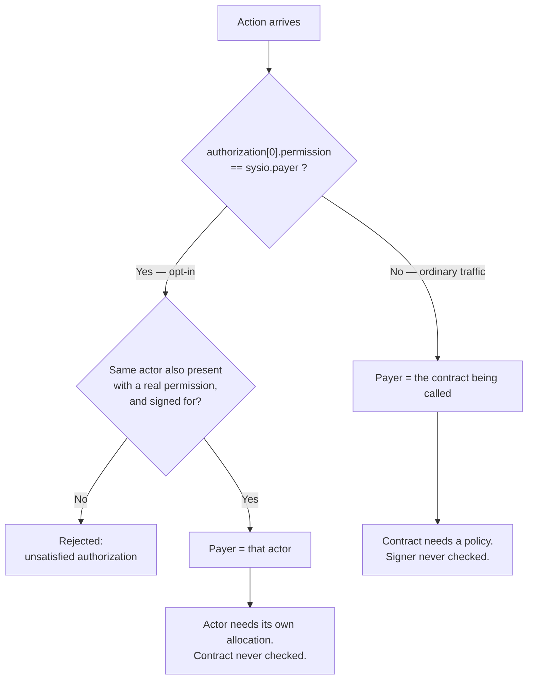

# Resource Owner Allocation (ROA)

How Wire pays for CPU, NET, and RAM — and why end users don't.

---

## The short version

**A new account on Wire costs its owner nothing and can immediately use every provisioned
contract on the network.** It holds no CPU or NET allocation, does not need one, and never
acquires one — because the applications it calls pay instead of it.

That is the whole model in one line. The rest of this page is how it works and what it costs the
people who do pay.

**Applications pay, users don't.** When you sign an ordinary transaction, the CPU time and network
bandwidth it consumes are billed to the *contract account you called*. Sending tokens, swapping on
a DEX, minting an NFT: the signing account is charged nothing and needs no allocation, stake, or
rental.

**Applications get paid for by node owners.** A contract cannot conjure its own capacity. It
receives a **policy** — a grant of CPU, NET, and RAM weight — from a **node owner**, who holds a
fixed share of the network's capacity determined by their tier and issues slices of it through the
`sysio.roa` contract. Only registered node owners can issue policies. No account can grant itself
bandwidth.

**A contract without a policy does not run.** Because the contract is the payer, an unprovisioned
one has nothing to pay with, and ordinary calls into it fail. Provisioning the contract — not the
user — is what makes an application usable.

There is one exception, covered in [Who pays](#who-pays-the-payer-model): an account can volunteer
to pay for itself. It is opt-in, it requires signatures, and it is not how ordinary traffic works.

---

## How this compares to Antelope-family chains

Antelope-family chains bill the signer, and over time offered three ways to fund that signer's
CPU and NET. Not every chain ran all three, and they arrived in sequence rather than as a set — so
what you have used depends on which chain and which era.

**Staking (2018).** You locked tokens with `delegatebw` to get a proportional share of CPU and NET,
and bought RAM outright from a Bancor-curve market with `buyram`. Users had to hold enough token to
stake, understand three resource types, and manage `undelegatebw` timing. A dApp onboarding new
users had to hand each of them staked tokens or build a custodial account layer. RAM price moved
with the market, so contract deployment cost moved with it.

**REX (2019).** A lending market let token holders rent out their staked CPU/NET for yield instead
of leaving it idle. It improved capital efficiency and added a third system to understand alongside
staking and the RAM market.

**PowerUp (2021).** Replaced REX rentals with a stateless daily-expiring rental priced off a
utilization curve. Simpler to use — you paid for a day's worth of CPU/NET — but the signer still
pays, still needs the chain's native token, and the price still moves with the utilization curve.

In all three, the account that signs is the account that is billed.

On Wire the signer is billed only if it asks to be. By default the contract is, and it is
provisioned once by a node owner issuing a policy, after which every account that calls it
transacts without charge. A signer that names itself with `sysio.payer` takes the bill instead —
the exception, not the ordinary path.

| | EOS staking | REX | PowerUp | **Wire ROA** |
|---|---|---|---|---|
| Who is billed for a transaction | Signer | Signer | Signer | **Called contract, unless the action names an explicit payer** |
| End user needs native token | Yes | Yes | Yes | **No** |
| CPU/NET acquired by | Locking tokens | Renting from a pool | Daily fee on a curve | **A node owner's policy** |
| RAM acquired by | Bancor market purchase | same | same | **A node owner's policy** |
| Acquisition price set by | RAM market | Rental market | Utilization curve | **Off-chain, between issuer and recipient** ([what the weight then buys is on-chain](#how-weight-becomes-throughput)) |
| Reclaimable by | Unstake (3d) | Sell rex | Expires daily | **`reducepolicy` after `time_block`** |
| Cost to onboard a user | Tokens + stake + RAM | same | same | **None to the user** |

---

## The three resources

Wire meters the same three resources Antelope does.

**CPU** — execution time, in microseconds. Metered per action and billed to that action's payer.

**NET** — transaction size on the wire, in bytes. Billed per action based on its serialized
billable size.

**RAM** — persistent state: account rows, permissions, contract code, and every table row a
contract writes. Measured in bytes. Unlike CPU and NET, RAM is not a rate — it is an occupancy
level. It is consumed when state is written and released when state is deleted.

CPU and NET replenish continuously over an averaging window. RAM does not replenish; it is freed
only by deleting the data holding it.

---

## Who pays: the payer model

This is the part that differs most from Antelope, and it is worth being precise about.

**The default: the called contract pays.** An ordinary transaction names no payer at all, so the
account billed for an action is the contract that action invokes. Nothing in the transaction has
to say so and no permission has to be added — this is what happens when you do nothing special,
which is the case for essentially all user traffic.

**The exception: an account can volunteer to pay for itself.** Wire reserves a permission name,
`sysio.payer`, for this. It is not a way to bill a stranger, and adding it is not a way to obtain
resources. The protocol requires all three of the following together:

- the `sysio.payer` entry sits at **index 0** of the action's authorizations,
- the **same actor** also appears on that action with a real permission, and
- the transaction carries **signatures** satisfying that actor's `active` authority.

You can only volunteer yourself, or someone who co-signs. An account that names itself payer needs
its own allocation and fails without one.

Those two rules are the whole of `action::payer()`:

```cpp
// libraries/chain/action.cpp
account_name action::payer() const {
   if (!authorization.empty() && authorization[0].permission == config::sysio_payer_name)
      return authorization[0].actor;   // the exception: index 0 named a payer
   return account;                     // the default: the contract being called
}
```



The transaction's billing map is keyed on `payer()` and nothing else. An authorizing account that
is not the payer never enters the map, so its CPU and NET are neither charged nor checked.

| Action authorizations | Payer | Notes |
|---|---|---|
| `{alice, active}` | `sysio.token` (the contract) | The default. Alice pays nothing. |
| `{alice, sysio.payer}, {alice, active}` | `alice` | Explicit self-pay. Alice needs her own allocation. |
| `{alice, sysio.payer}, {alice, active}, {bob, active}` | `alice` | Alice covers the whole action's cost. |

### Porting a contract from Antelope

This trips people up, so it is worth stating plainly.

On Antelope your contract works as soon as it is deployed, because the users calling it arrive with
their own staked or rented CPU and NET. On Wire they do not — every user account holds zero. Deploy
a ported contract, push a transaction the way you always have, and the call fails:

```
account <yourcontract> net usage is too high: 132 > 0
```

Nothing is wrong with the contract, the transaction, or the signer. The contract has no policy, and
the contract is the payer. It will look dead until a node owner issues it one.

The fix is not to change the contract or ask users to acquire resources. It is a single `addpolicy`
on the contract account. Once that exists, the same unmodified transaction succeeds, and every user
of that contract transacts for free.

### Why the contract can afford it

System accounts — anything whose name prefix is `sysio` — carry unlimited resource limits, and
`sysio.roa` preserves that: every code path that touches a `sysio.*` account's limits passes the
unlimited marker for CPU and NET, and `addpolicy` refuses to allocate CPU or NET to them at all. So
`sysio.token` transfers, `sysio.msig` proposals, and every other system-contract call are covered
by the system itself.

> **What `-1` means here.** Resource limits are signed integers, and `-1` is a **sentinel** — a
> reserved value meaning "no limit," not a quantity. The chain tests for it explicitly
> (`if (cpu_weight < 0) …`, `is_unlimited_cpu` returns `cpu_weight == -1`) and, where a number is
> actually needed, substitutes a large finite one rather than doing arithmetic on the `-1`. It is
> not a very large number, and it is not an overflow; reading it as either will mislead you when
> you look at a `get_account` response and see `-1` in the limit fields.

A third-party contract is different. It is an ordinary account, and it is the payer for every call
into it that does not name one explicitly — which is every ordinary call — so it needs a real
allocation. That is exactly what a ROA policy provides.

### What happens with no policy at all

An account created on Wire starts at **zero CPU, zero NET**, and 1,144 bytes of RAM — just enough
for its own account and permission rows:

```cpp
// contracts/sysio.system/src/sysio.system.cpp — native::newaccount
set_resource_limits( new_account_name, 0, 0, 0 );
transfer_ram( get_self(), new_account_name, sysiosystem::newaccount_ram );  // 1144 bytes
```

For a **user** account, those zeros are never consulted. It signs, the contract pays, the
transaction succeeds.

For a **contract** account, those zeros are fatal under default billing. The contract is the payer,
so calling one with no policy fails outright:

```
account payloadless net usage is too high: 132 > 0
```

The transaction throws. Nothing is charged to the caller and nothing is charged elsewhere.

That holds only while the contract is the payer. Because the billing map is keyed on `payer()` and
nothing else, an action carrying `{caller, sysio.payer}` puts the caller in the map and leaves the
contract out of it entirely — the contract's zero CPU and NET are never consulted. A provisioned
caller or relayer can therefore drive an otherwise unprovisioned contract, so long as the caller
has the capacity and any RAM the contract bills to *itself* is covered.

So an unprovisioned contract is inert for ordinary users, not universally inert. Provisioning it is
what makes it callable by anyone; without that, only a caller willing to pay its way can reach it.

---

## Policies

A policy is a grant of resource weight from a node owner (the **issuer**) to an account (the
**owner**), recorded in `sysio.roa`.

| Field | Meaning |
|---|---|
| `net_weight` | SYS-denominated weight granted for NET |
| `cpu_weight` | SYS-denominated weight granted for CPU |
| `ram_weight` | SYS-denominated weight granted for RAM |
| `bytes_per_unit` | Bytes per 0.0001 SYS, **frozen at the moment the policy was created** |
| `time_block` | Block height before which the policy cannot be reduced or reclaimed |

RAM weight converts to bytes at `bytes_per_unit`. At the network's launch price of 104 bytes per
0.0001 SYS, **1 SYS of `ram_weight` ≈ 1.04 MB**.

CPU and NET weight do not convert to a fixed quantity — they buy a proportional share of network
throughput. See [How weight becomes throughput](#how-weight-becomes-throughput).

### Who can issue one

Any registered node owner, of any tier. The check is membership, not rank:

```cpp
require_auth(issuer);
check(nodeowners.contains(node_key), "Only Node Owners can issue policies for this generation.");
```

There is no tier gate on `addpolicy`, `expandpolicy`, `extendpolicy`, or `reducepolicy`. A tier-3
node owner has exactly the same policy powers as a tier-1 node owner. What differs is budget size.

### Node owner tiers

| Tier | Share of `total_sys` per owner | Max owners | Aggregate share when full |
|---|---|---|---|
| 1 | 4% | 21 | 84.0% |
| 2 | 0.15% | 84 | 12.6% |
| 3 | 0.003% | 1,000 | 3.0% |

Registration consumes part of an owner's own budget — a personal RAM allocation, 10% of the tier
allocation set aside into the network RAM pool, and a small CPU/NET allocation for the owner's own
account. Using the launch configuration of 75,496 SYS `total_sys`:

| Tier | Total allocation | Free to issue after registration | ≈ RAM if spent entirely on RAM |
|---|---|---|---|
| 1 | 3,019.8400 SYS | ~2,717.75 SYS | ~2.8 GB |
| 2 | 113.2440 SYS | ~101.81 SYS | ~106 MB |
| 3 | 2.2649 SYS | ~1.93 SYS | ~2.0 MB |

Every `addpolicy` and `expandpolicy` checks `total_new_allocation <= node.total_sys -
node.allocated_sys`. A node owner cannot issue more than they hold.

### What registration provisions

`regnodeowner` spends part of the tier allocation before the owner has issued anything:

| Component | Amount | Scales with tier |
|---|---|---|
| `sysio` RAM pool grant | 10% of the tier allocation | Yes |
| Personal RAM | 0.0080 SYS (8,320 bytes) | No — flat |
| Personal NET | 0.0500 SYS | No — flat |
| Personal CPU | 0.0500 SYS | No — flat |

The 10% grant is not for the owner. It moves bytes into `sysio`'s RAM pool, which funds the
1,144-byte gift every new account on the network receives. It is written with
`time_block = UINT32_MAX` and is never reclaimable.

The three personal components land in a self-issued policy — `issuer == owner` — carrying
`time_block = 1`, so an owner can reshape or reclaim them immediately with `expandpolicy` or
`reducepolicy`. Because they are flat while the tier budgets are not, together they cost a tier-3
owner 4.77% of its allocation and a tier-1 owner 0.0036%.

### What a node owner needs to operate

Almost nothing. Managing policies costs a node owner no resources at all:

- `addpolicy`, `expandpolicy`, `extendpolicy`, and `reducepolicy` are actions on `sysio.roa`, so
  `payer()` resolves to `sysio.roa`, which carries unlimited CPU and NET.
- Every row the contract writes for registration and policy management is billed to `sysio.roa`
  as well — `policies`, `reslimit`, and `nodeowners` rows are all `emplace(get_self(), …)`.

An owner reduced to zero CPU, zero NET, and zero spare RAM can still issue a policy. Membership —
the `nodeowners` row — is what confers the ability to issue, not any allocation the owner holds.

The one exception is tier-1's `newuser`, which bills its `sponsors` and `sponsorcount` rows to
`creator`. Those are the only two writes in the contract charged to a node owner, so a tier-1
owner needs RAM headroom before its first `newuser` call.

### What differs between tiers

| | Tier 1 | Tier 2 | Tier 3 |
|---|---|---|---|
| Issue, expand, extend, reduce policies | Yes | Yes | Yes |
| Budget per owner | 3,019.8400 SYS | 113.2440 SYS | 2.2649 SYS |
| Max owners | 21 | 84 | 1,000 |
| `newuser` (sponsored accounts) | Yes | No | No |

Policy mechanics are identical across tiers — there is no tier check in any of the four policy
actions. `newuser` is the only tier-gated capability, guarded by
`check(node.tier == 1, "Creator is not a registered tier-1 node owner")`.

### Where network RAM comes from

`activateroa` splits the SYS left over after all tier allocations between two pools:

| Pool | Size | Funds |
|---|---|---|
| `sysio.roa` | ~157 MB, fixed | The contract's own rows: policies, reslimits, node-owner records |
| `sysio` | ~157 MB at activation, ~7.98 GB once every node owner has registered | The 1,144-byte gift every new account receives |

`sysio`'s pool grows as owners register, because each registration deposits 10% of its tier
allocation into it. At 1,144 bytes per account, the funded pool supports roughly 6.97 million
accounts.

The gap between those two pools is why `newuser` bills its sponsorship rows to the sponsoring
tier-1 owner rather than to the contract. `sysio.roa`'s pool is fixed at ~157 MB and would cap
sponsorship near 530,000 users — long before `sysio`'s account pool ran out. A tier-1 owner's own
free budget of ~2.83 GB is the only one that scales with how many users it actually onboards.

### The four policy actions

**`addpolicy`** — create a policy. Fails if this issuer already has one for this owner (use
`expandpolicy`). Weights must be in the core SYS symbol, non-negative, and at least one non-zero.

**`expandpolicy`** — add weight to an existing policy. Converts RAM at the *policy's* frozen
`bytes_per_unit`, not the current network price.

**`extendpolicy`** — push `time_block` further out. It can only move forward, never back, and never
to a block already in the past. A policy's term can be lengthened but not shortened.

**`reducepolicy`** — take weight back. Only callable once `time_block` has passed. Each weight is
capped at the stored policy weight, so an issuer can never withdraw more than they granted.

### Stacking policies from multiple issuers

The policy table is scoped per issuer, so the duplicate check is per issuer only. **An account can
hold policies from many node owners at once, and they sum into a single quota.**

Two node owners each granting `10.0000 SYS` of CPU and NET to the same account produce a combined
on-chain limit of `200000` weight units. Reduce one issuer's policy fully and the account drops to
`100000` — the other issuer's grant is untouched, and they can still expand it independently:

```
addpolicy    owner_A -> acct  10.0000 SYS cpu/net
addpolicy    owner_B -> acct  10.0000 SYS cpu/net
                              net = 200000   cpu = 200000

reducepolicy owner_A (full)   net = 100000   cpu = 100000    # B untouched
expandpolicy owner_B +5 SYS   net = 150000   cpu = 150000
```

This is how a contract gets provisioned by more than one sponsor: several node owners co-sponsor
the account, each on their own terms, each able to enter or exit without disturbing the others.

Four things to know when stacking:

- **Each policy has its own `time_block`.** The lock is per issuer. An account's total capacity is
  only as stable as its shortest-committed policy.
- **Each policy freezes its own byte price.** After a network-wide `setbyteprice`, two policies with
  identical `ram_weight` can represent different byte counts.
- **RAM reclaim competes.** On `reducepolicy` the reclaim is `min(unused RAM on the whole account,
  requested)`. If the account has consumed its RAM, an exiting issuer gets back less than they put
  in. CPU and NET always unwind cleanly.
- **The ceiling is network-wide unallocated SYS,** not a per-account cap. There is no limit on how
  many policies one account may hold.

---

## How weight becomes throughput

CPU and NET use the same proportional-share formula Antelope uses. An account's share of the
network's virtual capacity over the averaging window is:

```
max_use_in_window = virtual_capacity_in_window × your_weight / total_weight_across_all_accounts
```

The denominator is the sum of every account's positive CPU (or NET) weight — that is, the sum of
all weight handed out by ROA policies. Accounts with unlimited (`-1`) limits contribute zero to it.

The mechanism is unchanged from Antelope. **Only the source of the numerator changed.** In
Antelope the weight came from tokens staked with `delegatebw`. On Wire it comes from a policy a
node owner issued. Nothing about an account's token balance affects its resource share.

The practical consequence is the same as on Antelope: throughput is a share of a moving total. If
the network's total allocated weight grows and an account's does not, its slice shrinks. The only
remedy is more weight — `expandpolicy` from the existing issuer, or a policy from an additional
node owner.

`setbyteprice` does not help here. It rewrites `roastate.bytes_per_unit`, which governs how RAM
weight converts to bytes for policies struck afterwards, and touches neither CPU/NET weights nor
the total that divides them. That is also why each policy records the price it was struck at: so
its RAM conversion stays fixed when the network price later moves.

---

## Spam control

If the contract pays, what stops someone calling it in a loop for free? Two things, at two
different layers.

### The contract's own share is a hard cap

CPU and NET are rate limits over a window, and the payer's limit is the one that applies. Spam
aimed at a contract consumes that contract's share and nothing else. Once it is exhausted, further
calls fail with `tx_cpu_usage_exceeded` or `tx_net_usage_exceeded` naming the contract, and keep
failing until the window rolls forward.

That is the structural answer: the blast radius of spamming a contract is that contract. It cannot
spill onto other contracts, other users, or the rest of the network, because it was never drawing
on a shared pool — it was drawing on one policy's slice of the proportional share. The issuer's
exposure is bounded by what they granted and reclaimable via `reducepolicy` once `time_block`
passes.

This is objective, part of consensus, and applies on every node with no configuration.

### Subjective billing meters the signer

The objective rules never look at the signer. `nodeop` can, and that is where a producer
distinguishes a spammer from a legitimate user of the same contract.

Before executing, `transaction_context::verify_init_subjective_billing` takes the first
authorizers that are **not** payers and checks each one:

```
available = subjective-account-cpu-allowed-us
          + the account's own objective CPU limit
          − its accumulated subjective bill
```

For an ordinary account with no policy the objective limit is `0`, so the budget is exactly
`subjective-account-cpu-allowed-us` — **300,000 µs (300 ms) by default**. When `available` reaches
zero the transaction is dropped before execution, with a message of the form:

```
Subjectively terminated trx <id>. Authorized account <name> exceeded
subjective CPU limit 300000us by <n>us with an objective cpu limit of 0us.
```

`update_billed_cpu_time` feeds it: when an action's first authorizer differs from its payer, the
CPU is recorded against the signer as well, so the signer accrues a running cost even though the
objective bill went to the contract.

Two properties keep this landing on abusers rather than on ordinary users:

- **Successful transactions do not accumulate.** A subjective bill is held as `pending_cpu_us` and
  removed when the transaction appears in a block. Traffic that lands costs the signer nothing over
  time.
- **Failures accumulate and decay slowly.** A transaction that fails or expires moves its bill into
  a decaying accumulator whose window is `subjective-account-decay-time-minutes` — 24 hours by
  default. Repeatedly submitting transactions that fail is what burns the budget.

A blunter limiter runs alongside it: `subjective-account-max-failures` (default `3`) per
`subjective-account-max-failures-window-size` blocks (default `1`). An account over the limit has
its transactions rejected outright until the window resets:

```
transaction <id> exceeded failure limit for account <name> until <time>
```

Failures are blamed on every per-action first authorizer, so a multi-action transaction shares
responsibility across all of them.

### It is node-local, not consensus

A subjective drop never appears in a block. Two producers with different settings, different
traffic history, or different account exemptions can legitimately reach different decisions about
the same transaction. The recovery path for a dropped transaction is client resubmit, not
producer-side retry.

### Defaults

Subjective billing ships **off**. Both `disable-subjective-p2p-billing` and
`disable-subjective-api-billing` default to `true`, and when both are set the producer plugin
disables subjective billing entirely and logs `Subjective CPU billing disabled`. The failure
limiter is gated on the same flag, so it is off with it. Operators opt in per traffic source.

| Option | Default | Effect |
|---|---|---|
| `disable-subjective-p2p-billing` | `true` | Skip subjective enforcement for P2P transactions |
| `disable-subjective-api-billing` | `true` | Skip subjective enforcement for API transactions |
| `subjective-account-cpu-allowed-us` | `300000` | Subjective CPU budget above an account's objective limit |
| `subjective-account-decay-time-minutes` | `1440` | Time to return a full subjective budget |
| `subjective-account-max-failures` | `3` | Failures allowed per account per window |
| `subjective-account-max-failures-window-size` | `1` | Window size in blocks for the failure limit |
| `disable-subjective-payer-billing` | `false` | When billing is on, also meter the payer (the contract) |
| `disable-subjective-account-billing <acct>` | — | Exempt named accounts entirely |

Independent of all of it, `incoming-transaction-queue-size-mb` (default `1024`) subjectively drops
transactions with a resource-exhaustion error when the incoming queue overflows.

---

## Scenarios

### A user sends tokens

Alice has an account, no ROA policy, zero CPU, zero NET, and 1,144 bytes of RAM. She sends 10 TOK
to Bob.

She signs `{alice, active}` on `sysio.token::transfer`. The payer is `sysio.token`, a system
account with unlimited limits. The transfer succeeds. Alice's CPU usage after the transaction:
`0`.

**RAM:** `sysio.token` sets `ram_payer = "sysio"_n`, so it bills every balance row to the `sysio`
account rather than to sender or receiver. Measured over two transfers — the first creating Bob's
balance row from scratch, the second modifying an existing one:

```
alice ram 1068 -> 1068       unchanged
bob   ram 1068 -> 1068       unchanged, even though a NEW row was created
sysio ram 411951 -> 412239   +288 bytes = two rows
```

For `sysio.token`, transfers are RAM-free for both parties whether or not new state is created.
Alice is charged nothing, for anything, on a token transfer.

> This is a property of `sysio.token`'s implementation, not a universal rule — but a contract
> cannot unilaterally charge RAM to its users either. For a positive RAM delta billed to an account
> other than the receiving contract, `apply_context::validate_account_ram_deltas` requires that
> account to appear in the action's authorizations with the `sysio.payer` permission; without it
> the action fails with `Requested payer ... Missing sysio.payer`. And because `sysio.payer` must
> sit at index 0, adding it also makes that user the action's CPU and NET payer.
>
> So billing RAM to a user is an explicit opt-in by the user, not a choice the contract makes
> alone, and it opts them into paying for bandwidth at the same time. Contract authors who want the
> gasless experience should bill RAM to the contract account, which needs no such marker.
>
> **Compared with Antelope.** There, a contract names a RAM payer in the action body and the
> requirement is only that the named account authorized the action at all — CPU and NET follow a
> separate path entirely, funded by the signer's stake or rental. On Wire the two are welded
> together: naming a user as RAM payer requires the `sysio.payer` marker, and because that marker
> must sit at index 0 it makes the same user the CPU and NET payer for the action. There is no way
> to charge a user for storage while the contract absorbs their bandwidth.

### A developer deploys a contract

The developer needs one thing: a policy on the account that will hold the contract.

RAM sizing at the launch price of 104 bytes per 0.0001 SYS:

| Item | Bytes | `ram_weight` |
|---|---|---|
| A 60 KB contract WASM | ~61,440 | ~0.0591 SYS |
| ABI | ~4,000 | ~0.0039 SYS |
| 10,000 token holder rows @ ~144 B | ~1,440,000 | ~1.3847 SYS |

### Sizing CPU and NET

RAM has a direct conversion, so the table above can be exact. CPU and NET do not — a weight buys a
proportional share of network capacity, and the share depends on how much weight the whole network
has allocated. There is no protocol constant for "one transfer," and any document that gives you
one is guessing.

What you can do is measure and scale. Push the action once on testnet and read it back from the
transaction trace: `cpu_usage_us` for CPU, and the action's billable size for NET. Then work out
the rate you need — actions per averaging window, not actions in total — and ask a node owner for
weight that sustains it.

Two anchors to calibrate against:

- **NET is small and predictable.** It is just the serialized action, so it scales with argument
  size. A minimal no-argument action measures **132 bytes**; adding a second authorization took the
  same action to 148. A token transfer with a short memo is a few hundred.
- **CPU is the one to measure, not assume.** It depends on what the contract does and on the node's
  hardware and WASM runtime, so a figure from someone else's chain or from a debug build is not
  guidance. Measure yours.

For scale on the weight side: the allocation a node owner gives their own account at registration
is `0.0500 SYS` of each, and a routine test account is provisioned with `0.0010 SYS` of each.

Budget headroom beyond the steady-state rate. Failed and retried transactions still consume CPU and
NET, and a contract that saturates its share starts rejecting work until the window rolls forward.

The contract-plus-ABI footprint is **under one tenth of a SYS**. For scale, even a *tier-3* node
owner — the smallest tier — holds ~1.93 SYS free, enough to sponsor several small contracts.

The provisioning is a single `addpolicy` on the contract account. Because the contract is the payer
for any call that does not name one explicitly, ordinary users of that token are never billed — a
user is billed only if they opt in with `sysio.payer`, which the wallet or client would have to put
in the action deliberately. What the developer needs from the policy differs by resource, though:

- **CPU and NET are replenishing shares, not per-transaction payments.** They meter rate, not
  count, so a million transfers and ten transfers draw on the same weight. What the volume
  determines is whether that weight is a wide enough slice to sustain the rate; exceed it and
  transactions fail until the window rolls forward, rather than running down a balance.
- **RAM is occupancy, and it does accumulate.** Every transfer that creates a new holder row adds
  permanent state — the table above prices 10,000 of them at ~1.3847 SYS. A token expecting a
  million holders needs a policy sized for a million rows, or a contract that bills those rows
  elsewhere.

So the CPU/NET side is genuinely a one-time provisioning decision; the RAM side has to be sized for
the state the contract will hold.

### A trader swaps on a DEX

The trader signs swap actions on a DEX contract. Those actions do not name a payer, so the DEX
contract is billed for each of them and the trader is charged no CPU, no NET, and no RAM by the
protocol. A trader wanting throughput independent of the DEX's own share can opt into paying with
`sysio.payer`, but nothing requires it.

Any swap fee the trader pays is defined by the DEX contract's own economics, at the application
layer. There is no protocol-level resource charge underneath it.

### A contract exhausts its CPU

CPU and NET are rate limits over a window, not balances. A contract that saturates its share does
not run out of a balance — its transactions begin to fail with `tx_cpu_usage_exceeded` or
`tx_net_usage_exceeded` naming the contract account, and they succeed again as the window rolls
forward.

The fixes are ordinary capacity planning: `expandpolicy` from the existing issuer, or a second
policy from an additional node owner. Both take effect immediately and stack.

### A node owner onboards users

A **tier-1** node owner can call `roa::newuser`, which mints a sub-account under their own name
(`<owner>.<generated>`) with a supplied public key, funded with the standard 1,144-byte account
allocation drawn from the network pool.

The created account has **no CPU/NET policy** — and does not need one, because it transacts
against contracts that carry their own. A user gets an account at no cost to themselves and can
immediately use every provisioned contract on the network.

Two limits worth knowing:

- `newuser` is **tier-1 only**. Tiers 2 and 3 cannot use it.
- Nobody can call the native `newaccount` directly. Wire gates it on the creator being a privileged
  account, which replaced Antelope's name-suffix ownership rule. Account creation runs through
  `sysio.roa`, either via `newuser` or via the NFT-claim flow the OPP depot drives.

### Explicit self-pay

An account that bears its own cost — a relayer, an operator isolating its throughput from a shared
contract — puts `{self, sysio.payer}` first in the authorization list.

This requires a real allocation. An account with no policy attempting it fails immediately:

```
account alice net usage is too high: 148 > 0
```

Self-pay is the exception, not the default. It exists so a party with its own provisioned capacity
can avoid competing for a shared contract's window.

---

## What ROA is not

Mechanisms an Antelope background might lead you to look for, which do not exist on Wire:

- **No RAM market.** `buyram` and `sellram` do not exist. RAM is not priced by a Bancor curve and
  is not tradeable. It arrives only through a policy.
- **No REX, no PowerUp, no rentals.** None of these contracts or actions exist.
- **No `delegatebw`.** There is no way to convert a token balance into CPU, NET, or RAM. Those come
  from a node owner's policy and nowhere else.
- **No whitelist.** There is no allow-list of approved contracts. The only distinction is whether a
  contract holds a policy: with one it is callable by anyone, without one it is callable only by a
  caller who names itself with `sysio.payer` and covers the cost.

---

## Capacity distribution

Tier 1 holds 84% of network capacity across its 21 owners. What the protocol enforces around that:

**Issuance is not gated on tier.** All 1,105 node owners across the three tiers issue policies with
identical mechanics. There is no tier check in `addpolicy`, `expandpolicy`, `extendpolicy`, or
`reducepolicy`. The tiers differ in capacity, not in permission.

**Sponsorship is not exclusive.** Because policies from different issuers stack additively into one
quota, an account is never limited to a single issuer. It can hold grants from any number of node
owners simultaneously, and any one of them can exit — after their own `time_block` — without
affecting the others' grants.

**Grants are time-committed.** `reducepolicy` is blocked until `time_block`, and `extendpolicy` can
only push that block further out, never shorten it. An issuer commits to a term when they issue and
cannot reclaim before it elapses.

**Caps are enforced on-chain** against the authoritative node-owner rows — 21 / 84 / 1,000 —
counted in `regnodeowner` at registration time.

What the protocol does not do is set the price or the terms of a policy. ROA defines the allocation
primitive and its constraints; the terms on which any issuer grants one are not represented
on-chain.

---

## Reference

### Actions on `sysio.roa`

| Action | Authorization | Purpose |
|---|---|---|
| `addpolicy` | issuer (a node owner) | Create a policy for an account |
| `expandpolicy` | issuer | Increase an existing policy's weights |
| `extendpolicy` | issuer | Push `time_block` further out |
| `reducepolicy` | issuer, after `time_block` | Reclaim weight |
| `newuser` | tier-1 node owner | Create a sponsored sub-account |
| `newnameduser` | `sysio.roa` | Create a vanity account (NFT-claim flow) |
| `nodeownreg` | `sysio.roa` | Register a node owner from an OPP attestation |
| `forcereg` | `sysio.roa` | Register a node owner directly (governance/bootstrap) |
| `activateroa` | `sysio.roa` | Activate ROA and set the initial byte price |
| `setbyteprice` | `sysio.roa` | Change bytes-per-unit on network expansion |

### Tables

| Table | Scope | Contents |
|---|---|---|
| `roastate` | singleton | Activation flag, `total_sys`, `bytes_per_unit`, `network_gen` |
| `nodeowners` | `network_gen` | Node owner rows: tier, total and allocated SYS |
| `policies` | issuer | One row per (issuer, owner) pair |
| `reslimit` | global | Per-account totals summed across all its policies |

### Errors you may encounter

| Message | Meaning |
|---|---|
| `account X net usage is too high: N > 0` | X is the payer and has no NET allocation |
| `billed CPU time ... for the account X` | X exhausted its CPU share for the window |
| `Only Node Owners can issue policies for this generation.` | Issuer is not registered in that `network_gen` |
| `Not enough unallocated SYS for this policy.` | Issuer's budget is exhausted |
| `A policy for this owner already exists from this issuer.` | Use `expandpolicy` |
| `Cannot reduce policy before time_block` | The policy's committed term has not elapsed |
| `Cannot allocate CPU/NET to sysio accounts.` | System accounts keep unlimited CPU/NET by design |
| `Only privileged accounts can create new accounts` | Use `sysio.roa::newuser` instead of native `newaccount` |
| `Creator is not a registered tier-1 node owner` | `newuser` is tier-1 only |

---

*This document describes the implementation in the `wire-sysio` repository. The behavioural claims
above — contract-as-payer billing, the failure mode of an unprovisioned contract, RAM-free token
transfers, and multi-issuer policy stacking — were each verified against the code and confirmed
with executable tests. The transcript blocks reproduce actual test output.*
