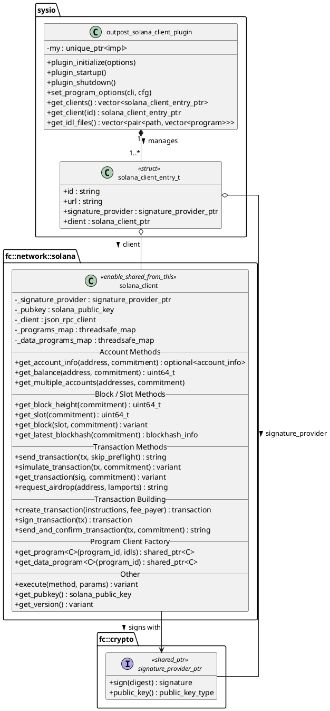
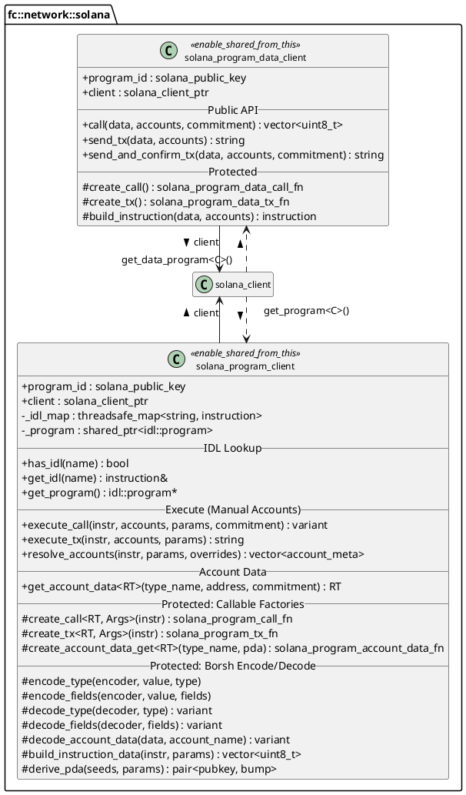
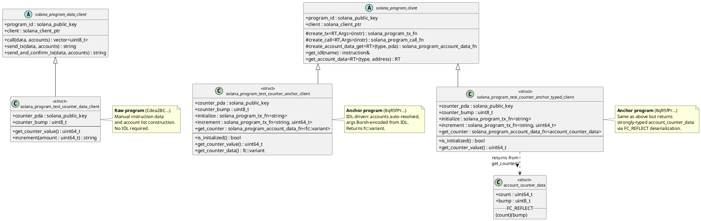
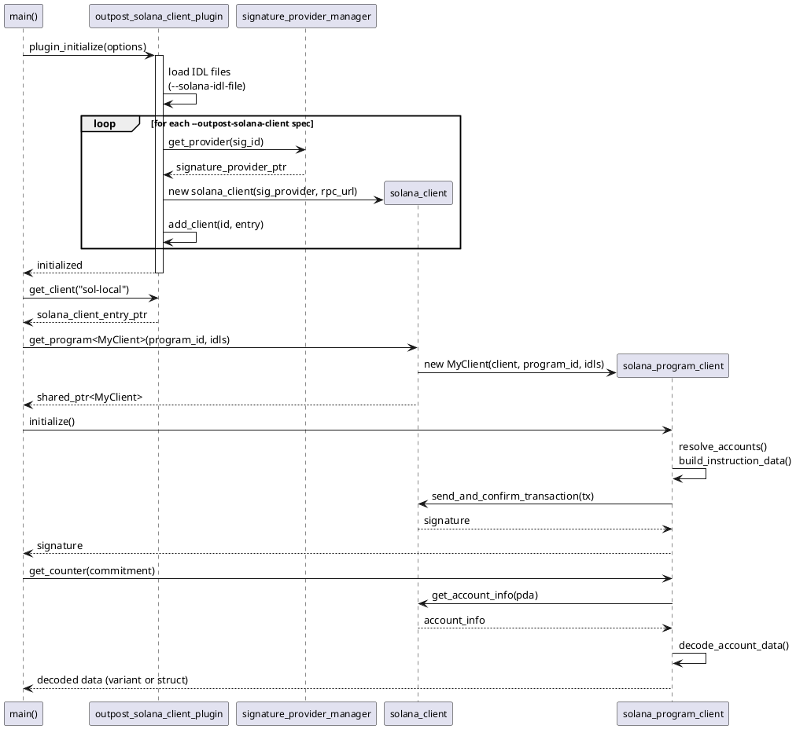

# Outpost Solana Client Plugin

The `outpost_solana_client_plugin` provides Solana JSON-RPC client integration for Wire Sysio. It manages the lifecycle and configuration of one or more `solana_client` instances, each backed by a `signature_provider` for transaction signing.

## Table of Contents

- [Plugin Configuration](#plugin-configuration)
- [Class Diagrams](#class-diagrams)
- [Client Architecture](#client-architecture)
- [solana_client (RPC Client)](#solana_client-rpc-client)
- [solana_program_data_client (Raw/Vanilla Programs)](#solana_program_data_client-rawvanilla-programs)
- [solana_program_client (Anchor/IDL Programs)](#solana_program_client-anchoridl-programs)
- [Typed Account Data with FC_REFLECT](#typed-account-data-with-fc_reflect)
- [Complete Tool Example](#complete-tool-example)
- [Supported Borsh Types](#supported-borsh-types)

---

## Plugin Configuration

### Required Plugins

The plugin depends on two other plugins that must also be configured:

- `signature_provider_manager_plugin` -- manages signing keys
- `outpost_client_plugin` -- base outpost client infrastructure

### Command-Line / Config File Options

#### `--signature-provider` (required)

Registers a signing key. Format:

```
<name>,<chain-kind>,<key-type>,<public-key>,<provider-type>:<data>
```

| Field | Description |
|---|---|
| `name` | Lookup ID for this provider (used in `--outpost-solana-client`) |
| `chain-kind` | Target chain: `solana`, `ethereum`, `wire` |
| `key-type` | Key algorithm, e.g. `ed` (ED25519 for Solana) |
| `public-key` | Base58 or hex-encoded public key |
| `provider-type:data` | Either `KEY:<private-key>` or `KIOD:<url>` |

Example using an inline private key:

```
--signature-provider sol-signer,solana,ed,PUB_ED_...,KEY:PVT_ED_...
```

#### `--outpost-solana-client` (required, multi-token)

Registers a Solana RPC client instance. Format:

```
<client-id>,<sig-provider-id>,<rpc-url>
```

| Field | Description |
|---|---|
| `client-id` | Unique identifier for this client instance |
| `sig-provider-id` | Name of a registered `--signature-provider` |
| `rpc-url` | Solana JSON-RPC endpoint URL |

Multiple clients can be configured:

```
--outpost-solana-client devnet-client,sol-signer,https://api.devnet.solana.com
--outpost-solana-client mainnet-client,sol-mainnet-signer,https://api.mainnet-beta.solana.com
```

#### `--solana-idl-file` (optional, multi-token)

Loads one or more Anchor IDL JSON files for use with `solana_program_client`:

```
--solana-idl-file /path/to/counter.json /path/to/another_program.json
```

### Full Example

```bash
./outpost_solana_client_tool \
   --signature-provider sol-signer,solana,ed,PUB_ED_abc123...,KEY:PVT_ED_def456... \
   --outpost-solana-client my-client,sol-signer,https://api.devnet.solana.com \
   --solana-idl-file ./idl/counter_anchor.json
```

### Config File

The same options work in a config `.ini` file:

```ini
signature-provider = sol-signer,solana,ed,PUB_ED_abc123...,KEY:PVT_ED_def456...
outpost-solana-client = my-client,sol-signer,https://api.devnet.solana.com
solana-idl-file = ./idl/counter_anchor.json
```

---

## Class Diagrams

### Plugin & Client Hierarchy



### Program Client Classes



### Tool Example Clients

The following diagram shows the concrete client implementations from `solana_client_rpc_tool/main.cpp`, demonstrating both raw and IDL-based program interaction patterns.



### Plugin Lifecycle Sequence



---

## Client Architecture

```
outpost_solana_client_plugin
   |
   +-- solana_client (JSON-RPC + signing)
          |
          +-- get_program<T>()       --> solana_program_client  (Anchor/IDL)
          +-- get_data_program<T>()  --> solana_program_data_client (raw/vanilla)
```

- **`solana_client`** -- low-level RPC client with transaction signing
- **`solana_program_data_client`** -- base class for raw (non-IDL) program interaction
- **`solana_program_client`** -- base class for Anchor/IDL-based program interaction with automatic account resolution, Borsh encoding/decoding, and typed callable functions

Client instances are cached by `(program_id, client_type)` pair, so calling `get_program<MyClient>(id)` multiple times returns the same instance.

---

## solana_client (RPC Client)

The `solana_client` wraps all standard Solana JSON-RPC methods and provides transaction building/signing.

### Accessing the Client

```cpp
#include <sysio/outpost_solana_client_plugin.hpp>

auto& sol_plug = app->get_plugin<sysio::outpost_solana_client_plugin>();
auto client_entry = sol_plug.get_client("my-client");
auto& client = client_entry->client; // solana_client_ptr
```

### Basic RPC Queries

```cpp
// Chain info
auto slot = client->get_slot();
auto block_height = client->get_block_height();
auto version = client->get_version();

// Account info
auto balance = client->get_balance(client->get_pubkey());
auto account = client->get_account_info(some_address);

// Blockhash
auto blockhash = client->get_latest_blockhash();
```

### Building and Sending Transactions

```cpp
// Build a system transfer instruction
auto instr = system::instructions::transfer(from, to, lamports);

// Create, sign, and send
auto tx = client->create_transaction({instr}, client->get_pubkey());
client->sign_transaction(tx);
auto sig = client->send_and_confirm_transaction(tx);
```

---

## solana_program_data_client (Raw/Vanilla Programs)

For programs without an Anchor IDL. You manually construct instruction data and account lists.

### Defining a Custom Data Client

From `solana_client_rpc_tool/main.cpp` -- the raw counter program client:

```cpp
#include <fc/network/solana/solana_client.hpp>
#include <fc/network/solana/solana_system_programs.hpp>

using namespace fc::network::solana;

struct solana_program_test_counter_data_client : solana_program_data_client {
   static constexpr const char* COUNTER_SEED = "counter";

   solana_public_key counter_pda;
   uint8_t counter_bump;

   solana_program_test_counter_data_client(const solana_client_ptr& client,
                                           const solana_public_key& program_id)
      : solana_program_data_client(client, program_id) {
      std::vector<std::vector<uint8_t>> seeds = {
         std::vector<uint8_t>(COUNTER_SEED, COUNTER_SEED + strlen(COUNTER_SEED))
      };
      std::tie(counter_pda, counter_bump) =
         system::find_program_address(seeds, program_id);
   }

   uint64_t get_counter_value() {
      auto account_info = client->get_account_info(counter_pda);
      if (!account_info.has_value() || account_info->data.size() < 8)
         return 0;
      uint64_t value = 0;
      std::memcpy(&value, account_info->data.data(), sizeof(uint64_t));
      return value;
   }

   std::string increment(uint64_t increment_amount) {
      // Build raw instruction data: 8-byte little-endian u64
      std::vector<uint8_t> data(8);
      std::memcpy(data.data(), &increment_amount, sizeof(uint64_t));

      // Build accounts manually
      std::vector<account_meta> accounts = {
         account_meta::signer(client->get_pubkey(), true),
         account_meta::writable(counter_pda, false),
         account_meta::readonly(system::program_ids::SYSTEM_PROGRAM, false)
      };

      return send_and_confirm_tx(data, accounts);
   }
};
```

### Using the Data Client

```cpp
auto program_id = solana_public_key::from_base58("Cdea2BCiWYBPTQJQq2oWjn5vCkfgENSHNG4GVnWqSvyw");
auto raw_counter = client->get_data_program<solana_program_test_counter_data_client>(program_id);

uint64_t value = raw_counter->get_counter_value();

auto sig = raw_counter->increment(1);
uint64_t new_value = raw_counter->get_counter_value();
```

---

## solana_program_client (Anchor/IDL Programs)

For Anchor programs with IDL definitions. The client automatically handles:

- Borsh encoding/decoding of instruction arguments
- Anchor 8-byte instruction discriminators
- Account resolution (signers, PDAs, fixed addresses)
- PDA derivation from IDL seed definitions
- Account data decoding from IDL type definitions

### Defining an Anchor Client

From `solana_client_rpc_tool/main.cpp` -- the Anchor counter program client:

```cpp
#include <fc/network/solana/solana_client.hpp>
#include <fc/network/solana/solana_system_programs.hpp>

using namespace fc::network::solana;

struct solana_program_test_counter_anchor_client : solana_program_client {
   static constexpr const char* COUNTER_SEED = "counter";

   solana_public_key counter_pda;
   uint8_t counter_bump;

   // Typed callable functions -- created from IDL
   solana_program_tx_fn<std::string> initialize;
   solana_program_tx_fn<std::string, uint64_t> increment;
   solana_program_account_data_fn<fc::variant> get_counter;

   solana_program_test_counter_anchor_client(const solana_client_ptr& client,
                                              const solana_public_key& program_id,
                                              const std::vector<idl::program>& idls = {})
      : solana_program_client(client, program_id, idls) {
      std::vector<std::vector<uint8_t>> seeds = {
         std::vector<uint8_t>(COUNTER_SEED, COUNTER_SEED + strlen(COUNTER_SEED))
      };
      std::tie(counter_pda, counter_bump) =
         system::find_program_address(seeds, program_id);

      // Bind IDL instructions to typed callable functions
      initialize = create_tx<std::string>(get_idl("initialize"));
      increment  = create_tx<std::string, uint64_t>(get_idl("increment"));

      // Bind account data getter (returns fc::variant)
      get_counter = create_account_data_get<fc::variant>("Counter", counter_pda);
   }

   bool is_initialized() {
      auto account_info = client->get_account_info(counter_pda);
      return account_info.has_value() && !account_info->data.empty();
   }

   uint64_t get_counter_value() {
      if (!is_initialized())
         return 0;
      return get_counter(commitment_t::confirmed)["count"].as_uint64();
   }

   fc::variant get_counter_data() {
      if (!is_initialized())
         return fc::variant();
      return get_account_data<fc::variant>("Counter", counter_pda);
   }
};
```

### Using the Anchor Client

```cpp
auto program_id = solana_public_key::from_base58("8qR5fPrG9YWSWc68NLArP8m4JhM4e1T3aJ4waV9RKYQb");
auto anchor_counter = client->get_program<solana_program_test_counter_anchor_client>(
   program_id, all_idls);

// Initialize (accounts auto-resolved from IDL)
if (!anchor_counter->is_initialized()) {
   auto sig = anchor_counter->initialize();
}

// Read current value
uint64_t value = anchor_counter->get_counter_value();

// Increment (argument Borsh-encoded from IDL args definition)
auto sig = anchor_counter->increment(5);
uint64_t new_value = anchor_counter->get_counter_value();
```

### Key API

| Method | Description |
|---|---|
| `get_idl(name)` | Look up an IDL instruction definition by name |
| `create_tx<RT, Args...>(instr)` | Create a state-changing transaction function |
| `create_call<RT, Args...>(instr)` | Create a read-only simulation function |
| `create_account_data_get<RT>(type, pda)` | Create a reusable account data getter |
| `get_account_data<RT>(type, address)` | One-shot fetch and decode account data |
| `resolve_accounts(instr, params, overrides)` | Manually resolve accounts from IDL |

---

## Typed Account Data with FC_REFLECT

Instead of accessing decoded account data through `fc::variant` with string key lookups, you can define a C++ struct that mirrors the IDL type and use `FC_REFLECT` for automatic deserialization.

### Example: IDL Type Definition

Given an Anchor IDL with this type:

```json
{
  "types": [
    {
      "name": "Counter",
      "type": {
        "kind": "struct",
        "fields": [
          { "name": "count", "type": "u64" },
          { "name": "bump", "type": "u8" }
        ]
      }
    }
  ]
}
```

### Step 1: Define a Matching C++ Struct

The struct field names **must** match the IDL field names exactly. The IDL decoder first produces an `fc::variant`, and `FC_REFLECT` enables conversion to your struct via `variant.as<T>()`.

```cpp
#include <fc/reflect/reflect.hpp>

struct account_counter_data {
   uint64_t count = 0;
   uint8_t bump = 0;
};
FC_REFLECT(account_counter_data, (count)(bump))
```

### Step 2: Define a Typed Client

From `solana_client_rpc_tool/main.cpp` -- the typed Anchor counter client:

```cpp
struct solana_program_test_counter_anchor_typed_client : solana_program_client {
   static constexpr const char* COUNTER_SEED = "counter";

   solana_public_key counter_pda;
   uint8_t counter_bump;

   solana_program_tx_fn<std::string> initialize;
   solana_program_tx_fn<std::string, uint64_t> increment;

   // Typed getter -- returns account_counter_data directly
   solana_program_account_data_fn<account_counter_data> get_counter;

   solana_program_test_counter_anchor_typed_client(
      const solana_client_ptr& client,
      const solana_public_key& program_id,
      const std::vector<idl::program>& idls = {})
      : solana_program_client(client, program_id, idls) {
      std::vector<std::vector<uint8_t>> seeds = {
         std::vector<uint8_t>(COUNTER_SEED, COUNTER_SEED + strlen(COUNTER_SEED))};
      std::tie(counter_pda, counter_bump) =
         system::find_program_address(seeds, program_id);

      initialize = create_tx<std::string>(get_idl("initialize"));
      increment  = create_tx<std::string, uint64_t>(get_idl("increment"));

      // Use account_counter_data instead of fc::variant
      get_counter = create_account_data_get<account_counter_data>("Counter", counter_pda);
   }

   bool is_initialized() {
      auto account_info = client->get_account_info(counter_pda);
      return account_info.has_value() && !account_info->data.empty();
   }

   uint64_t get_counter_value() {
      if (!is_initialized())
         return 0;
      // Direct struct field access -- no string key lookups
      return get_counter(commitment_t::confirmed).count;
   }
};
```

### Step 3: Use It

```cpp
auto typed_counter = client->get_program<solana_program_test_counter_anchor_typed_client>(
   program_id, all_idls);

// get_counter() returns account_counter_data, not fc::variant
account_counter_data data = typed_counter->get_counter(commitment_t::confirmed);
uint64_t count = data.count;
uint8_t bump = data.bump;

// Or use the convenience method
uint64_t value = typed_counter->get_counter_value();
```

### IDL Type to C++ Type Mapping for FC_REFLECT

| IDL Type | C++ Type |
|---|---|
| `bool` | `bool` |
| `u8` | `uint8_t` |
| `u16` | `uint16_t` |
| `u32` | `uint32_t` |
| `u64` | `uint64_t` |
| `u128` | `fc::uint128` |
| `u256` | `fc::uint256` |
| `i8` | `int8_t` |
| `i16` | `int16_t` |
| `i32` | `int32_t` |
| `i64` | `int64_t` |
| `i128` | `fc::int128` |
| `i256` | `fc::int256` |
| `f32` | `float` |
| `f64` | `double` |
| `string` | `std::string` |
| `bytes` | `std::vector<uint8_t>` |
| `publicKey` | `solana_public_key` (use base58 string in variant) |

---

## Complete Tool Example

The following is the complete `main()` from `solana_client_rpc_tool/main.cpp`, demonstrating plugin initialization, RPC queries, and interaction with all three client types (raw, Anchor/variant, Anchor/typed):

```cpp
int main(int argc, char* argv[]) {
   try {
      appbase::scoped_app app;

      app->set_version_string(sysio::version::version_client());
      app->set_full_version_string(sysio::version::version_full());

      application::register_plugin<signature_provider_manager_plugin>();
      application::register_plugin<outpost_client_plugin>();
      application::register_plugin<outpost_solana_client_plugin>();

      if (!app->initialize<signature_provider_manager_plugin,
                           outpost_client_plugin,
                           outpost_solana_client_plugin>(argc, argv, initialize_logging)) {
         const auto& opts = app->get_options();
         if (opts.contains("help") || opts.contains("version") ||
             opts.contains("full-version") || opts.contains("print-default-config"))
            return 0;
         return 1;
      }

      auto& sol_plug = app->get_plugin<sysio::outpost_solana_client_plugin>();

      // Get the first configured client
      auto clients = sol_plug.get_clients();
      FC_ASSERT(!clients.empty(), "No Solana clients configured");

      auto client_entry = clients[0];
      auto& client = client_entry->client;

      ilog("Connected to Solana RPC: {}", client_entry->url);
      ilog("Signer public key: {}", client->get_pubkey().to_base58());

      // ── Basic RPC Queries ──
      auto slot = client->get_slot();
      auto block_height = client->get_block_height();
      auto balance = client->get_balance(client->get_pubkey());
      auto version = client->get_version();

      // ── Load IDL files ──
      auto& idl_files = sol_plug.get_idl_files();
      std::vector<idl::program> all_idls;
      for (auto& [file_path, programs] : idl_files) {
         for (auto& prog : programs)
            all_idls.push_back(prog);
      }

      // ── Raw Counter Program (solana_program_data_client) ──
      const solana_public_key counter_program_id =
         solana_public_key::from_base58("Cdea2BCiWYBPTQJQq2oWjn5vCkfgENSHNG4GVnWqSvyw");
      auto raw_counter =
         client->get_data_program<solana_program_test_counter_data_client>(counter_program_id);

      uint64_t current_value = raw_counter->get_counter_value();
      auto sig = raw_counter->increment(1);

      // ── Anchor Counter Program (solana_program_client, fc::variant) ──
      const solana_public_key anchor_program_id =
         solana_public_key::from_base58("8qR5fPrG9YWSWc68NLArP8m4JhM4e1T3aJ4waV9RKYQb");
      auto anchor_counter =
         client->get_program<solana_program_test_counter_anchor_client>(
            anchor_program_id, all_idls);

      if (!anchor_counter->is_initialized())
         anchor_counter->initialize();

      auto anchor_sig = anchor_counter->increment(5);

      // ── Typed Anchor Counter (solana_program_client, account_counter_data) ──
      auto typed_counter =
         client->get_program<solana_program_test_counter_anchor_typed_client>(
            anchor_program_id, all_idls);

      uint64_t typed_value = typed_counter->get_counter_value();
      auto typed_sig = typed_counter->increment(3);

   } catch (const fc::exception& e) {
      elog("{}", e.to_detail_string());
      return 1;
   } catch (const std::exception& e) {
      elog("{}", e.what());
      return 1;
   }
   return 0;
}
```

---

## Supported Borsh Types

The IDL encoder/decoder supports all standard Anchor IDL types:

- **Primitives**: `bool`, `u8`-`u256`, `i8`-`i256`, `f32`, `f64`, `string`, `bytes`, `publicKey`
- **Option**: `{ "option": <type> }` -- encoded as 1-byte tag + value
- **Vec**: `{ "vec": <type> }` -- encoded as 4-byte LE length + elements
- **Array**: `{ "array": [<type>, <size>] }` -- fixed-size, no length prefix
- **Defined (struct/enum)**: `{ "defined": { "name": "<type>" } }` -- resolved from IDL `types` section
- **Struct**: fields encoded in order
- **Enum**: 1-byte variant index + variant fields
